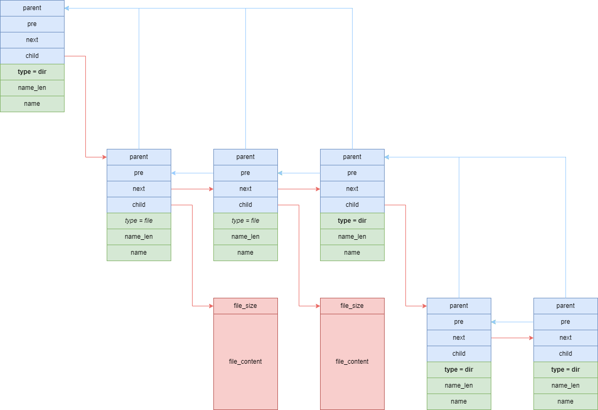
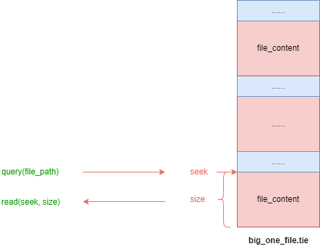

# tie

## Files packing library
The aim of the project is to create an lightweight, easy understanding file packing library. Tie is not a replacement for zip tar or 7z, but similar to them. Tie pack files under a folder into 1 file which implemented in 100 lines of code only. The most important feature of tie format is that you can read a specific file from a .tie packing file without unpack the .tie file first, not like zip tar or 7z.The following images illustrate the data structure of a .tie file and how to read the .tie file directly without unpacking it first.
### tie data structure

### how to read

 
## How to Use
- pack a folder into .tie file
```shell
./tiec /path/of/input/folder /path/of/output/xxx.tie
```
- unpack .tie file
```shell
./tiex /path/of/input/xxx.tie /path/of/output/folder 
```
- extract file from .tie file
```shell
./tiex_file /path/of/input/xxx.tie /relative/file/path /path/of/output/file 
```

## More application scenario
- **read only file system for embeded system** 

if you are using flash as your embeded system storage device, and you have to immigrate a file system so you can search and read file by name, tie can be an option.

- **pack or unpack while transfering**

if you want to transmit a folder which contains lots of small files, it will cost much more time than just 1 big file. Using tie library you can transfer the whole folder while packing, not after packing. 

- **web asserts server**

if you are writing a http file server, you can pack all asserts into a .tie file, and server the file request by locate the file position and read the file content directly from the .tie file, then send back to client.
